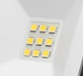
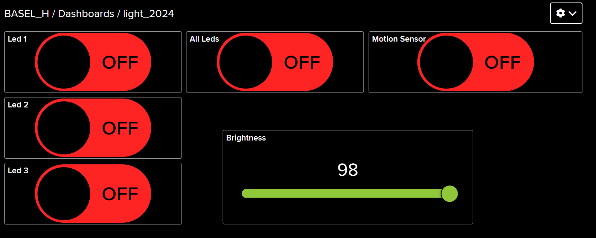

# Smart LED Lighting System
Basel Hassan, bh222jx

## Project Overview

This project centers around developing a Smart LED Lighting System utilizing IoT technology for responsive e8nvironmental monitoring. Leveraging a microcontroller and energy-efficient LEDs, the goal is to create a lighting system that adapts dynamically to its surroundings, emphasizing both automation and energy-saving principles.

**Estimated Project Time**: 24-28 hours.

---

## Objective

### Rationale
The motivation behind this project stems from a desire to delve into IoT technology for smart systems. By focusing on adaptive lighting, the project aims to investigate automated systems that can enhance energy efficiency while offering greater control.

#### Goals
The primary goals include:
- Creating a system capable of controlling LED lighting remotely.
- Ensuring real-time system responsiveness to environmental data.

#### Expected Results
The expected outcomes are:
- Ability to analyze environmental conditions in real-time.
- Creation of an energy-efficient lighting system.
- Potential applications for smart homes and broader IoT ecosystems.

---

## Components

### Bill of Materials

1.   
   **Part Name**: Raspberry Pi Pico W  
   **Details**: Core microcontroller for the system  
   **Price**: 100kr

2.   
   **Part Name**: LEDs (3W)  
   **Details**: Main lighting elements  
   **Price**: 200kr

3.   
   **Part Name**: Miscellaneous Wires  
   **Details**: Required for making all necessary connections  
   **Price**: 40kr

---

### Component Information

1. **Raspberry Pi Pico W**  
   Functions as the main controller for connecting all sensors and actuators.  
   **Cost**: 100kr

2. **3W LEDs (3 units)**  
   High-power LEDs, controlled by a switch for adjustable brightness and focused illumination.  
   **Cost**: 200kr

3. **Miscellaneous Wires**  
   Provides stable electrical connections across components.  
   **Cost**: 40kr

---


## Software Setup

### Selected Development Environment
- **IDE**: Visual Studio Code, extended with the C/C++ plugin.

### Installation Steps

1. **Install CMake**
   - Follow platform-specific instructions to install CMake, necessary for managing the build process:
     - For Linux: `sudo apt-get install cmake`
     - For macOS: `brew install cmake`
     - For Windows: [Download from CMake website](https://cmake.org/download/).

2. **Install ARM GCC Toolchain**
   - Install the ARM toolchain for compiling code for the Raspberry Pi Pico:
     - [Download from ARM Developer](https://developer.arm.com/tools-and-software/open-source-software/developer-tools/gnu-toolchain/gnu-rm).

3. **Install Visual Studio Code**
   - Download Visual Studio Code from its [official site](https://code.visualstudio.com/), or use a package manager:
     - On Linux (Debian): `sudo apt install code`

4. **C/C++ Extension Setup**
   - In VS Code, install the C/C++ plugin from the Extensions menu.

5. **Set Up CMake for Raspberry Pi Pico**
   - After cloning the Pico SDK, ensure the environment variable is set up correctly to point to the SDK directory.

6. **Install FreeRTOS Dependencies**
   - If required, add FreeRTOS as a submodule for real-time task scheduling.

7. **Build the Project**
   - Use CMake to configure and build the project


# Final IoT Smart Lighting Project

## Overview

This project combines IoT components for smart lighting control. It utilizes a Raspberry Pi Pico to read and send data using MQTT, and thus control multiple high-power LEDs and adjust LED brightness. The system communicates wirelessly via MQTT and can be monitored remotely through a dashboard.

## Circuit Design

The project integrates the following components:

- **Pico W**: Microcontroller.
- **3W LEDs**: Provides high-intensity lighting.

## Connections
 **3W LEDs**:
   - **GPIO Pins 0, 1, 2, 3**: Controls for each individual LED.
   

## Platform and Software

The system runs locally using a Raspberry Pi Pico and an MQTT server. This configuration allows real-time control of the smart lighting with low latency.

## Core Code Functionalities

- **WiFi and MQTT Setup**: Connects to WiFi and MQTT server for data transmission.
  ```cpp
  void wifi_task(void) {
    // Connect to Wi-Fi
    cyw43_arch_init();
    cyw43_arch_enable_sta_mode();

    // Connect to the Wi-Fi network - loop until connected
    while (cyw43_arch_wifi_connect_timeout_ms(WIFI_SSID, WIFI_PASSWORD, CYW43_AUTH_WPA2_AES_PSK, 30000) != 0)
    {
        printf("Attempting to connect...\n");
    }

    // Print a success message once connected
    printf("Connected to Wi-Fi\n");
    wifi_connected = true;
  }
  ```

- **LED Control**: Controls LEDs based on received MQTT messages.
  ```cpp
  static void mqtt_pub_data_cb(void *arg, const u8_t *data, u16_t len, u8_t flags) {
    if (data_in > 0)
    {
        data_in -= len;
        memcpy(&buffer[data_len], data, len);
        data_len += len;

        if (data_in == 0)
        {
            buffer[data_len] = '\0'; // Ensure null termination for string operations
            printf("Message received: %s\n", buffer);

            // Check if the message is "All_ON" or "All_OFF"
            if (strcmp((char *)buffer, "All_ON") == 0)
            {
                gpio_put(LED0, 1);
                gpio_put(LED1, 1);
                gpio_put(LED2, 1);
                gpio_put(LED3, 1);
                gpio_put(Led_Strip, 1);
            }
            else if (strcmp((char *)buffer, "All_OFF") == 0)
            {
                gpio_put(LED0, 0);
                gpio_put(LED1, 0);
                gpio_put(LED2, 0);
                gpio_put(LED3, 0);
                gpio_put(Led_Strip, 0);
            }
            else if (strcmp((char *)buffer, "LED0_ON") == 0)
            {
                gpio_put(LED0, 1);
            }
            else if (strcmp((char *)buffer, "LED0_OFF") == 0)
            {
                gpio_put(LED0, 0);
            }
            else if (strcmp((char *)buffer, "LED1_ON") == 0)
            {
                gpio_put(LED1, 1);
            }
            else if (strcmp((char *)buffer, "LED1_OFF") == 0)
            {
                gpio_put(LED1, 0);
            }
            else if (strcmp((char *)buffer, "LED2_ON") == 0)
            {
                gpio_put(LED2, 1);
            }
            else if (strcmp((char *)buffer, "LED2_OFF") == 0)
            {
                gpio_put(LED2, 0);
            }
            else if (strcmp((char *)buffer, "LED3_ON") == 0)
            {
                gpio_put(LED3, 1);
            }
            else if (strcmp((char *)buffer, "LED3_OFF") == 0)
            {
                gpio_put(LED3, 0);
            }
            // Reset buffer for next message
            data_len = 0;
        }
    }
  }
  ```

### Explanation
- **WiFi Task**: Handles connecting to WiFi.
- **Light Control**: Adjusts LED brightness based on MQTT messages.

---

## Transmitting the Data / Connectivity

### Data Transmission
- **Frequency**: Data sent every 10 seconds.
- **Wireless Protocols**: Uses WiFi for connectivity.
- **Transport Protocols**: MQTT for messaging.
- **Design Choices**: MQTT chosen for its lightweight nature and ease of use with IoT devices.

---

## Presenting the Data

### Dashboard
- **Visualization**: Data is displayed on a web-based dashboard using Adafruit IO, providing real-time monitoring and control capabilities.
- **Data Storage**: Data is stored and managed through Adafruit IO, ensuring easy access and analysis.
- **Data Saving Frequency**: Every 10 seconds, data is uploaded to Adafruit IO for continuous tracking and visualization.

### Dashboard



---

### Conclusion
This IoT project provides practical skills in electronics, coding, and IoT system integration. By combining environmental sensing with smart lighting control, it offers a hands-on approach to building advanced IoT solutions suitable for home automation, energy conservation, and smart living environments.